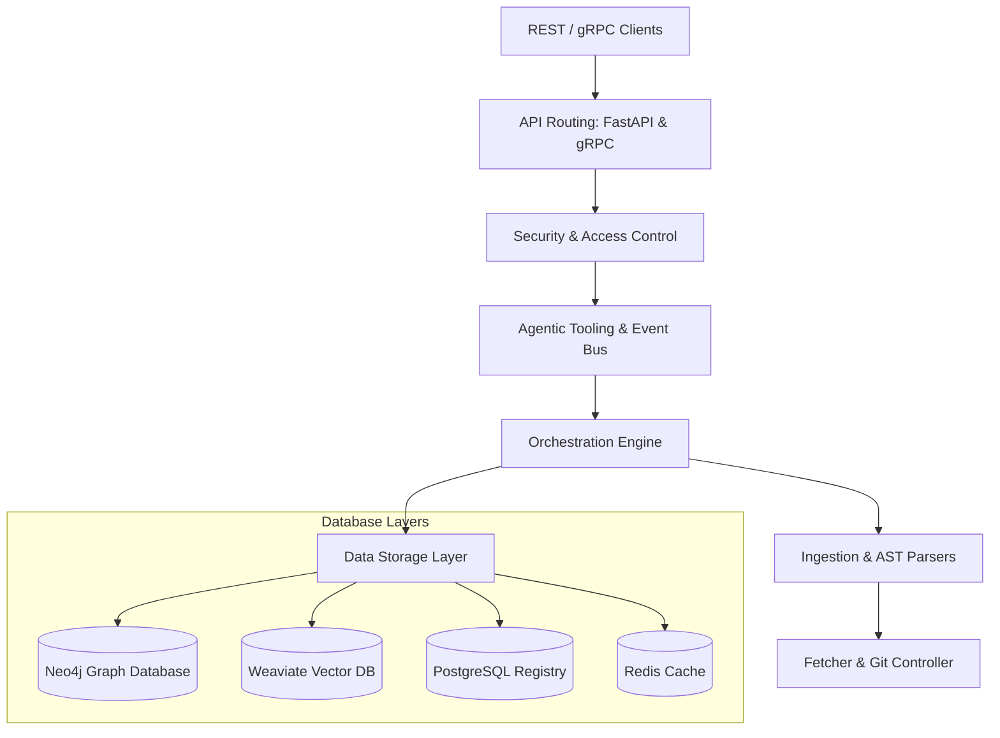

# System Architecture Overview

This document provides a high-level overview of the Repository Intelligence Agent architecture.

---

## Component Details

### 1. Ingestion Engine
- **Fetcher**: Clones target repositories locally, validates git commit signature keys, and handles repo webhooks.
- **Tree-sitter AST Parsers**: Custom code analysis parsers parsing Go, Java, JavaScript, Python, and TypeScript into structural elements (classes, methods, imports, functions, annotations).
- **Dependency & ACS Analyzer**: Uses NetworkX to build localized import/call graphs, calculate dependency metrics, and output Architectural Criticality Scores (ACS).

### 2. Database Layout
- **PostgreSQL**: Used as the registry index. Stores repository metadata, ingestion job statuses, indexing locks, organization permissions, and audit logs.
- **Neo4j**: Graph store modeling entities and relationships (`Repository`, `File`, `Service`, `Symbol`, `Commit`). Intercepts and traces dependency hops and blast radius impacts.
- **Weaviate**: Vector store holding code chunk embeddings computed via OpenAI/Gemini or MiniLM models. Enables semantic query search.
- **Redis**: High-speed cache for file retrieval, rate limiting counters, and task queue management.

### 3. API & Middleware Gateway
- **REST Endpoints**: Managed by FastAPI, handling search, trace resolution, and batch queries.
- **gRPC Server**: Managed by Python `grpcio` library serving proto RPC clients over port `50052`.
- **Security Middleware**: Authenticates JWT claims, enforces Role-Based Access Control (RBAC), and manages Fernet symmetric encryption for caching sensitive files.
