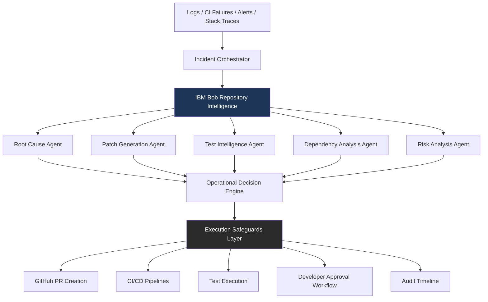

# **RuntimeOps**

### **Autonomous Incident Intelligence for Modern Engineering Teams**

RuntimeOps is a repository-aware AI engineering system that autonomously investigates production failures, reasons across real codebases, proposes remediations, and safely assists developers through controlled execution workflows powered by AI.

---

# **Vision**

Modern software systems are too complex for human-only operational workflows.

Incidents today require engineers to:

- navigate massive repositories
- correlate logs with deployments
- trace dependencies across services
- understand architectural context
- identify regressions
- manually coordinate fixes

RuntimeOps introduces an AI-native operational workflow where repository-aware agents collaborate to:

- investigate failures
- explain root causes
- generate fixes
- validate impact
- assist remediation

while maintaining developer oversight and execution safety.

---

# **Problem**

Engineering teams lose significant time during:

- production outages
- CI/CD failures
- regression debugging
- dependency breakages
- architecture drift
- incident triage

Current AI coding tools help generate snippets but fail to:

- understand system-wide context
- correlate operational failures with repository state
- reason across files and services
- safely execute engineering workflows

Large engineering systems require:

- repository-level reasoning
- operational intelligence
- controlled autonomous execution
- human oversight for risky actions

---

# **Solution**

RuntimeOps is a repository-aware AI incident analysis and remediation platform.

The platform:

1. Ingests operational signals
2. Understands the repository using IBM Bob
3. Coordinates specialized engineering agents
4. Identifies likely root causes
5. Generates fixes and tests
6. Evaluates remediation risk
7. Assists developers through controlled workflows

---

# **Core Concept**

RuntimeOps treats software incidents as:

reasoning problems across repositories, infrastructure, and execution history.

Instead of isolated AI prompts, the system operates with:

- full repository awareness
- architectural understanding
- multi-step operational workflows
- constrained autonomous execution

---

# **Primary Use Case**

## **Production Incident Response**

Example:

```text
Payment API begins returning HTTP 500 errors after deployment.
```

RuntimeOps:

- ingests logs and stack traces
- analyzes deployment diff
- traces impacted services
- identifies likely regression source
- explains architectural impact
- proposes patch
- generates regression tests
- prepares remediation PR
- evaluates deployment risk
- requests approval before high-risk execution

---

# **Why IBM Bob Matters**

IBM Bob provides:

- repository-wide reasoning
- architecture understanding
- cross-file context awareness
- multi-step code analysis
- software system comprehension

RuntimeOps uses Bob as the central repository intelligence engine.

Bob enables:

- dependency tracing
- impact analysis
- architectural navigation
- semantic understanding of large systems

Without repository awareness, autonomous engineering workflows become shallow and unreliable.

---

# **System Architecture**



---

# **Key Features**

# **1. Repository-Aware Incident Analysis**

RuntimeOps understands:

- service boundaries
- architectural relationships
- dependency graphs
- cross-file interactions
- deployment impact

The system can:

- trace failures through repositories
- correlate operational signals with code changes
- identify likely root causes

---

# **2. Autonomous Root Cause Investigation**

The system:

- analyzes logs
- parses stack traces
- maps execution flows
- identifies suspicious commits
- correlates regressions with deployments

Output:

```text
Probable Root Cause:
Authentication middleware introduced null session handling regression in payment-service/auth/session.py
Confidence: 87%
```

---

# **3. Patch Generation**

RuntimeOps can:

- generate remediation patches
- suggest architectural fixes
- update impacted files
- preserve repository conventions

The generated patch includes:

- explanation
- impacted services
- rollback guidance

---

# **4. Test Intelligence**

The system automatically:

- identifies affected test suites
- generates regression tests
- predicts blast radius
- validates fix confidence

This reduces:

- broken deployments
- regression propagation
- manual QA effort

---

# **5. Deployment Risk Analysis**

RuntimeOps classifies engineering actions by operational risk.

Example:

|**Action**|**Risk**|
|---|---|
|Generate documentation|LOW|
|Update test files|LOW|
|Modify dependency versions|MEDIUM|
|Deploy to production|HIGH|

High-risk operations require explicit approval.

---

# **6. Controlled Autonomous Workflows**

The platform supports:

- safe automation
- constrained execution
- developer oversight

The system never performs destructive operations silently.

Examples:

- production deployment approvals
- rollback confirmations
- infrastructure modification safeguards

---

# **7. Engineering Audit Timeline**

Every action is recorded into a replayable operational timeline.

Example:

```text
[20:01] Incident detected
[20:02] Repository analysis started
[20:03] Payment service dependency graph mapped
[20:04] Regression identified
[20:05] Patch generated
[20:06] Deployment approval requested
```

This improves:

- explainability
- operational trust
- debugging visibility

---

# **Multi-Agent Workflow**

RuntimeOps coordinates specialized agents:

|**Agent**|**Responsibility**|
|---|---|
|Root Cause Agent|Failure investigation|
|Patch Agent|Remediation generation|
|Test Agent|Regression prevention|
|Dependency Agent|Blast radius analysis|
|Risk Agent|Operational safety scoring|

Each agent operates with repository context provided by IBM Bob.

---

# **Example Workflow**

## **Incident**

```text
Checkout API latency spikes after deployment.
```

## **RuntimeOps Flow**

### **Step 1**

CI/CD alert ingested.

### **Step 2**

IBM Bob analyzes:

- deployment diff
- impacted services
- repository architecture

### **Step 3**

Root Cause Agent identifies:

```text
Redis connection pool exhaustion caused by retry-loop regression.
```

### **Step 4**

Patch Agent:

- generates fix
- updates retry strategy

### **Step 5**

Test Agent:

- creates regression test
- validates connection lifecycle

### **Step 6**

Risk Engine classifies:

```text
Production deployment = HIGH RISK
```

### **Step 7**

Developer approval requested.

### **Step 8**

PR generated with:

- patch
- reasoning
- incident summary
- rollback instructions

---

# **Technical Stack**

|**Layer**|**Technology**|
|---|---|
|Frontend|Next.js + Tailwind|
|Backend|FastAPI|
|Repository Intelligence|IBM Bob|
|Orchestration|LangGraph|
|LLM Layer|Gemini / OpenAI|
|Queue / State|Redis|
|Observability|OpenTelemetry|
|Persistence|PostgreSQL|
|CI Integration|GitHub Actions|
|Deployment|Docker Compose|

---

# **Frontend Experience**

The UI focuses on:

- operational clarity
- repository visibility
- incident timelines
- remediation workflows

Core views:

- Incident Dashboard
- Repository Graph
- Risk Analysis Panel
- Approval Queue
- Generated PR Review
- Execution Timeline

---

# **Example UI Panels**

## **Incident Overview**

```text
Severity: HIGH
Affected Services: payment-api, auth-service
Deployment Correlation: YES
Likely Regression Commit: 8f4c2ab
```

## **AI Reasoning**

```text
Root Cause Confidence: 87%
Primary Failure Source:
Session validation middleware retry recursion.
```

## **Risk Panel**

```text
Operation:
Deploy generated patch to production

Risk Level:
HIGH

Approval Required:
YES
```

---

# **Why This Project Matters**

AI coding assistants currently optimize:

- code generation

RuntimeOps optimizes:

- engineering operations

This is the next evolution:

AI-native operational engineering workflows.

The platform reduces:

- debugging time
- operational overhead
- repository navigation cost
- remediation coordination complexity

while increasing:

- reliability
- explainability
- developer confidence

---

# **Innovation**

RuntimeOps combines:

- repository-aware AI reasoning
- operational intelligence
- autonomous engineering workflows
- controlled execution safeguards

Unlike traditional copilots, RuntimeOps:

- reasons across systems
- correlates operational state with repository structure
- orchestrates remediation workflows
- assists engineering operations end-to-end

---

# **Hackathon Alignment**

RuntimeOps directly aligns with the hackathon challenge:

|**Challenge Goal**|**RuntimeOps Alignment**|
|---|---|
|Improve software workflows|Autonomous incident remediation|
|Use repository context|IBM Bob repository reasoning|
|Reduce repetitive work|Automated debugging + patch generation|
|Practical developer tooling|Engineering operations platform|
|Multi-step workflows|Investigation → remediation → validation|
|Real-world value|Production engineering acceleration|

---

# **Future Scope**

Future versions could support:

- Kubernetes remediation
- Infrastructure-as-Code analysis
- autonomous rollback systems
- distributed tracing integration
- cross-repository architecture reasoning
- security-aware remediation
- enterprise policy engines

---

# **Final Positioning**

RuntimeOps transforms AI from a coding assistant into an operational engineering partner capable of understanding repositories, reasoning through failures, and safely accelerating software remediation workflows.
